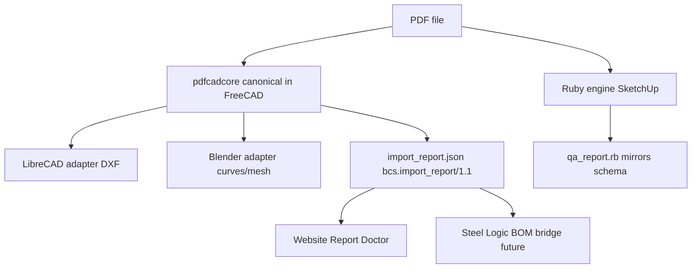
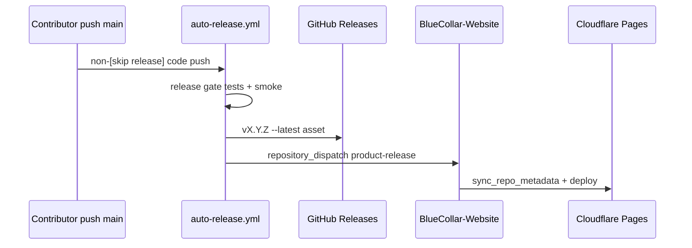

# Contributor Handoff — BlueCollar PDF Importer Ecosystem

**Document ID:** QA-2026-06-26_contributor-handoff  
**Audience:** New contributors who must work autonomously across all repos  
**Classification:** Anonymous-friendly — no author attribution required  
**Last updated:** 2026-07-01  
**Status:** **START HERE** — authoritative onboarding for engineering, QA, and release work  
**HEAD snapshot date:** 2026-07-01 (verify live SHAs with `git rev-parse HEAD` before acting)

---

## How to use this document

Read **only this file** plus linked paths. It supersedes scattered session notes for onboarding purposes. For deep historical context, follow links into `_LLM_CONTROL_PACK/QA/` mirrors. For anonymous multi-reviewer rounds, obey `Instructions 0607202613216.txt`.

**Authoritative Q&A drop zone:** `C:\Users\Rowdy Payton\Desktop\PDFTest Files\Q&A\`  
**Git mirrors:** `_LLM_CONTROL_PACK/QA/` in each canonical repo (see §2)

---

## 1. Mission and north star

### 1.1 What we are building

BlueCollar Systems builds **PDF vector importers** for fabrication-shop CAD workflows across four hosts — SketchUp, FreeCAD, LibreCAD (2D), and Blender — plus a **Steel Logic** mobile/desktop app and the **BlueCollar website** for downloads, install help, and import-report diagnosis.

The engineering north star is **100% visual and scalable accuracy on real-world PDFs**, verified by the private test corpus and honest host limits — **not** by hacking synthetic targets or claiming pixel parity across hosts.

### 1.2 Four text modes in every host (within honest limits)

Per **BCS-ARCH-001** (`_LLM_CONTROL_PACK/BCS-ARCH-001.md`), text rendering is orthogonal to import mode (Auto / Vector / Raster / Hybrid):

| Text mode | Purpose |
|-----------|---------|
| **Labels** | Host-native editable text (SketchUp labels, FreeCAD ShapeString, LibreCAD DXF TEXT, Blender text objects) |
| **Glyphs** | Text converted to outline geometry (non-editable) |
| **Geometry** | Full stroke geometry including text paths |
| **3D Text** | Extruded or display text where the host supports it |

LibreCAD is **2D honest**: GUI exposes Labels and Outlines only; CLI retains all four modes but `3d_text` and `glyphs` export as DXF TEXT equivalent to Labels.

### 1.3 Any-PC portability

Every importer must run on **any Windows PC** without relying on OS-bundled Python, Ruby, or Poppler:

- Bundled **Poppler** (SketchUp vector extraction helpers)
- Bundled **PyMuPDF** (Python hosts; Blender uses cp310-abi3 wheel vendoring)
- Portable installers: SketchUp RBZ, FreeCAD Inno Setup EXE + ZIP, LibreCAD portable ZIP, Blender add-on ZIP
- Preflight commands verify dependencies before import (`--preflight`, `preflight_check.py`, SketchUp Import Health)

Non-technical fab-shop users are a first-class audience. One-click or few-click install paths beat developer-only workflows.

### 1.4 Legacy host support (non-negotiable gate)

**SketchUp 2017 / Ruby 2.2** is the hardest compatibility floor. Any Ruby 2.3+ syntax in the SketchUp extension is a **release blocker**. CI enforces this via `check_su2017_ruby_compat.py`, `ruby22_compat_test.rb`, and Docker Ruby 2.2 syntax scans.

All hosts target **current stable + prior versions** where practical, on **oldest practical hardware**.

### 1.5 Steel Logic and Blue Collar ecosystem ambition

Beyond CAD importers:

- **Steel Logic app** — offline AISC v16 shape lookup, inventory, calculators, PDF callout lookup (partial BOM bridge)
- **steel_shapes packs** — DXF/DWG/SketchUp shape libraries shipped with importers
- **Website Report Doctor** — consumes `import_report.json` for plain-English diagnostics
- **Future bridge** — PDF-BOM → takeoff via `import_report.json` / CSV ingestion (callout lookup shipped; full ingestion open)

### 1.6 What we do not claim

1. 100% on every PDF class (encrypted, corrupt, scanned-without-OCR, exotic encodings)
2. LibreCAD 3D text
3. Pixel parity across hosts (text engines, mesh vs NURBS, DXF limitations differ)
4. CI green = field sign-off (human confirmation required)
5. Per-span OCG on geometry text (layer grouping only)
6. Blender per-character glyph objects (Glyphs = text-run outline meshes)

---

## 2. Repo map (every repo)

### 2.1 Priority order (explicit)

When priorities conflict, follow this order:

1. **SketchUp first**, then FreeCAD, LibreCAD, Blender
2. **Field accuracy** over feature breadth
3. **Ruby 2.2 / SU 2017** is a non-negotiable gate
4. **Release pipeline integrity** (test/smoke gates, Windows-correct assets)
5. **Website/docs truth** (download links, capability matrix, install copy)
6. **Corpus and golden oracles** (regression evidence, not the whole requirement)
7. **Steel Shapes app bridge** (lower priority but in ecosystem)

### 2.2 Stale paths — do not use

| Stale path | Why |
|------------|-----|
| `C:\1SU-PDFimporter` | Empty; not a git clone |
| `C:\1FC-PDFimporter` | Absent; use `C:\1PDF-Importer-FreeCAD` |
| `C:\1LC-PDFimporter` | Absent; use `C:\1PDF-Importer-LibreCAD` |
| `C:\1BL-PDFimporter` | Absent; use `C:\1PDF-Importer-Blender` |
| `C:\1pdfcadcore` | No standalone repo; embedded in FC, synced to LC/BL |

### 2.3 SketchUp — `C:\1PDF-Importer-SketchUp`

| Field | Value |
|-------|-------|
| **GitHub** | https://github.com/BlueCollar-Systems/PDF-Importer-SketchUp |
| **Branch / HEAD** | `main` @ `5d6d027c3640048bfd48fb2ded6994a0ffa773ec` |
| **Version (committed)** | **3.7.75** (`PLUGIN_VERSION` in `extracted/sketchup_ext/bc_pdf_vector_importer.rb`) |
| **Live `--latest` release** | **v3.7.75** (2026-06-26) |
| **Tech stack** | Ruby extension; native PDF content-stream parser; bundled Poppler in RBZ |
| **Core engine** | Ruby mirror of `import_report` schema — not Python pdfcadcore |

**Key directories:**

```
extracted/sketchup_ext/bc_pdf_vector_importer/   # Extension source
steel_shapes/                                     # AISC SketchUp shape packs
test/                                             # ruby22_compat, smoke, corpus, golden oracle
tools/                                            # Build helpers, baseline generators
.github/workflows/                                # CI + auto-release
_LLM_CONTROL_PACK/                                # Governance + QA mirror
build_release.py                                  # RBZ packaging
```

**Build:** `tools/fetch_third_party_binaries.ps1` → `python build_release.py` → `SketchUp-PDF-Importer_vX.Y.Z.rbz`

**Test (local):**

```powershell
cd C:\1PDF-Importer-SketchUp
python tools/check_su2017_ruby_compat.py extracted/sketchup_ext
ruby test/ruby22_compat_test.rb
ruby test/smoke_test.rb
ruby test/import_health_test.rb
$env:BCS_CORPUS_ROOT = 'C:\1pdf-test-corpus'
ruby test/corpus_placement_test.rb
```

**CI workflows:**

| Workflow | Purpose |
|----------|---------|
| `su-pdfimporter-ci.yml` | PR/push CI |
| `auto-release.yml` | Release gate → RBZ → GitHub Release `--latest` |
| `corpus-placement.yml` | Corpus baseline regression |
| `steel-shapes-release.yml` | `steel-v*` tag releases |
| `notify-website-deploy.yml` | `repository_dispatch` → website metadata refresh |

**Auto-release behavior:**

- Trigger: push to `main` (ignores `*.md`, `docs/**`, `steel_shapes/**`; **does not** ignore `.github/**`)
- Skips: `chore: bump version to`, `automation/version-bump`, `[skip release]`
- Gate: Ruby 2.2 compat, syntax check, full Ruby test suite including `ruby22_compat_test.rb`
- Version: **committed** in source — CI does not auto-bump
- Artifact: `SketchUp-PDF-Importer_v{version}.rbz`, tagged `v{version}`, marked `--latest`

---

### 2.4 FreeCAD — `C:\1PDF-Importer-FreeCAD`

| Field | Value |
|-------|-------|
| **GitHub** | https://github.com/BlueCollar-Systems/PDF-Importer-FreeCAD |
| **Branch / HEAD** | `main` @ `f2d335bcfa59ca16edf1fbc3070d9a5cc79fbb96` |
| **Version (committed)** | **4.0.54** (`PDFVectorImporter/package.xml`, `pyproject.toml`) |
| **pdfcadcore version** | **1.0.0** (canonical copy at `PDFVectorImporter/pdfcadcore/`) |
| **Live `--latest` release** | **v4.0.54** (2026-06-26) |
| **Tech stack** | Python workbench; PyMuPDF; embedded pdfcadcore |

**Key directories:**

```
PDFVectorImporter/              # Workbench + canonical pdfcadcore
pdfcadcore/                     # Top-level sync copy (if present)
installer/                      # Inno Setup Windows installer
scripts/smoke_release_zip.py    # Post-build Windows wheel smoke
tests/                          # pytest suite
steel_shapes/                   # DXF/DWG packs
pdfcadcore_sync_check.py        # Mandatory sync gate
```

**Build:** `python build_release.py`; Windows installer: `python build_windows_installer.py`

**Test:**

```powershell
cd C:\1PDF-Importer-FreeCAD
python pdfcadcore_sync_check.py --skip-cross-repo
python -m pytest tests/ -q
python scripts/smoke_release_zip.py   # after build
```

**CI workflows:** `fc-pdfimporter-ci.yml`, `auto-release.yml` (**windows-latest**), `windows-release.yml`, `steel-shapes-release.yml`, `notify-website-deploy.yml`

**Auto-release:** Gate (sync + compile + vendor PyMuPDF + pytest) → ZIP on `windows-latest` → smoke verifies Windows `.pyd` not Linux `.so` → GitHub Release

---

### 2.5 LibreCAD — `C:\1PDF-Importer-LibreCAD`

| Field | Value |
|-------|-------|
| **GitHub** | https://github.com/BlueCollar-Systems/PDF-Importer-LibreCAD |
| **Branch / HEAD** | `main` @ `643e069cc63b0d70333bea31bda88320e4f2f1fd` |
| **Version (committed)** | **1.0.48** (`pdf2dxf.py`) |
| **pdfcadcore version** | **1.0.0** (synced from FreeCAD) |
| **Live `--latest` release** | **v1.0.48** portable ZIP first (2026-06-26) |
| **Tech stack** | Python CLI/GUI; PyInstaller portable; embedded pdfcadcore; 2D honest |

**Key directories:**

```
librecad_pdf_importer/          # Importer package
pdfcadcore/                     # Synced from FC
pdf2dxf.py                      # CLI entry + version
build_windows_portable.py       # Portable EXE bundle (canonical install)
scripts/smoke_portable_zip.py   # pdf2dxf.exe --help smoke
plugin/                         # Native LibreCAD menu plugin (secondary)
```

**Build:** `python build_release.py` (source ZIP); `python build_windows_portable.py` (portable — **canonical**)

**Test:**

```powershell
cd C:\1PDF-Importer-LibreCAD
python preflight_check.py
python pdfcadcore_sync_check.py --skip-cross-repo
python -m pytest tests/ -q
python scripts/smoke_portable_zip.py   # after portable build
```

**CI workflows:** `lc-pdfimporter-ci.yml`, `auto-release.yml` (**windows-latest**, portable-first), `release.yml`, `notify-website-deploy.yml`

**Critical:** `--latest` must be the **Windows portable ZIP**, not source-only. `RELEASE_BUMP_TOKEN` was deleted; use `github.token`.

---

### 2.6 Blender — `C:\1PDF-Importer-Blender`

| Field | Value |
|-------|-------|
| **GitHub** | https://github.com/BlueCollar-Systems/PDF-Importer-Blender |
| **Branch / HEAD** | `main` @ `1f2ea3598cdc872aa0deebcebe1489d2d8505cea` |
| **Version (committed)** | **1.0.51** (`pdf_vector_importer/__init__.py` bl_info) |
| **pdfcadcore version** | **1.0.0** (synced from FC) |
| **Live `--latest` release** | **v1.0.51** (2026-06-26) |
| **Tech stack** | Blender 5.x add-on; cp310-abi3 PyMuPDF bootstrap |

**Key directories:**

```
pdf_vector_importer/            # Primary add-on
blender_pdf_vector_importer/    # Legacy mirror entry
pdfcadcore/                     # Synced from FC
tests/
scripts/smoke_release_zip.py
```

**Build:** `python build_release.py` → `dist/Blender-PDF-Importer_*.zip`

**Test:**

```powershell
cd C:\1PDF-Importer-Blender
python pdfcadcore_sync_check.py --skip-cross-repo
python -m ruff check .
python -m pytest tests/ -v
```

**CI workflows:** `bl-pdfimporter-ci.yml`, `auto-release.yml`, `release.yml`, `notify-website-deploy.yml`

**Known P1:** Ships Windows-only PyMuPDF wheel; off-Windows bootstrap is best-effort only.

---

### 2.7 Website — `C:\1BlueCollar-Website`

| Field | Value |
|-------|-------|
| **GitHub** | https://github.com/BlueCollar-Systems/BlueCollar-Website |
| **Branch / HEAD** | `main` @ `f70f80f779d5cbcc5043523345a4f9ef1a0f7974` |
| **VERSION file** | **1.0.65** |
| **Tech stack** | Static HTML/CSS/JS; Cloudflare Pages; no build step |
| **Live site** | https://bluecollar-systems.com |

**Key files:** `index.html`, `nav.js`, `repo-metadata.json`, `tools/sync_repo_metadata.py`, `docs/`

**Metadata:** `repo-metadata.json` is refreshed by `website-ci.yml` via `tools/sync_repo_metadata.py` on deploy and after importer `product-release` dispatches. Re-run locally when validating download links offline.

**CI workflows:** `website-ci.yml` (static checks → metadata sync → Cloudflare deploy), `auto-release.yml` (auto-bumps `VERSION` patch), `security-remediation.yml`

**Auto-release:** Auto-increments patch in `VERSION` on each `main` push; creates snapshot ZIP release. **No product build gates** — static site only.

**Handoff mirror:** Contributor handoff doc is mirrored in `_LLM_CONTROL_PACK/QA/` across ecosystem repos.

**Policy:** Do **not** host SketchUp Make 2017 installer on the website (Trimble redistribution constraints).

---

### 2.8 Test corpus — `C:\1pdf-test-corpus`

| Field | Value |
|-------|-------|
| **GitHub** | https://github.com/BlueCollar-Systems/pdf-test-corpus (**private**) |
| **Branch / HEAD** | `main` @ `d478dda1ea9cc03bf0734f2dae28ea1fb02f80fe` |
| **Schema** | `bcs.test_corpus/1` in `manifest.json` |
| **Purpose** | Tier-1/Tier-2 PDF manifest; golden oracle IDs; contract schemas |

**Setup:**

```powershell
$env:BCS_CORPUS_ROOT = 'C:\1pdf-test-corpus'
python C:\1pdf-test-corpus\tools\list_tier1.py --host SU --resolved
python C:\1pdf-test-corpus\tools\acquire_tier1.ps1 -MirrorDesktop
```

**Key paths:**

```
manifest.json                   # Tier entries + oracle_id (e.g. GO-06)
tier1/web/, tier1/user/         # Shop PDFs (user tier gitignored)
tier2/web/
schemas/
tools/list_tier1.py, dependency_audit.py, validate_contract_schemas.py
PRETEST_ACCEPTANCE_CONTRACTS.md
```

**No CI workflows.** Corpus is consumed by importer CI and human confirmation.

**Desktop mirror:** `C:\Users\Rowdy Payton\Desktop\PDFTest Files\` — user shop PDFs; never commit proprietary PDFs to git.

---

### 2.9 Steel Logic app — `C:\1 Structural_Steel_Shapes_App`

| Field | Value |
|-------|-------|
| **GitHub** | https://github.com/BlueCollar-Systems/Steel-Shapes |
| **Branch / HEAD** | `main` @ `24ab835390f29432e96604815c0c044cc6da73db` |
| **Version** | **1.0.9+11** (`pubspec.yaml`); live release **v1.0.10** |
| **Tech stack** | Flutter; Android/iOS/Windows |

**Build:** `build_release.bat`; `flutter build appbundle`; Windows: `package_windows_release.bat`

**Test:** `flutter analyze`; `flutter test`; `dart run tools/l10n_audit.dart`

**CI workflows:** `flutter-ci.yml`, `auto-release.yml`, `notify-website-deploy.yml`

**Auto-release:** Auto-bumps patch + build number; may produce tag-only release if Android signing secrets missing.

**Spec:** `docs/Structural Steel Shapes App Master Brief v1.7.2.docx.docx`

---

## 3. Architecture

### 3.1 Engine layout



- **pdfcadcore** lives in `PDFVectorImporter/pdfcadcore/` (FreeCAD). Synced to LibreCAD and Blender via manifest + `pdfcadcore_sync_check.py`.
- **SketchUp** maintains a **Ruby mirror** — not a Python subprocess for core import.
- There is **no** standalone `C:\1pdfcadcore` repo.

### 3.2 import_report schema `bcs.import_report/1.1`

**Canonical Python:** `pdfcadcore/import_report.py`  
**SketchUp mirror:** `qa_report.rb`, Import Health menu

**Key fields:**

| Field | Purpose |
|-------|---------|
| `schema`, `version`, `source_pdf` | Identity + SHA-256 of source |
| `fidelity` | Primitive counts, text mode, fallback flags |
| `extra.human_summary` | Plain-English import narrative |
| `extra.scale_crosscheck` | Scale agreement banner data |
| `extra.font_substitution_note` | R2-2 — font fallback disclosure |
| `extra.performance_hint` | R2-8 — timing guidance |
| `extra.pdf_interactive_note` | R2-6 — PDF JS detected, not executed |

**Consumers:** host Import Health UI, website Report Doctor, future Steel Logic ingestion.

### 3.3 Shared concepts

| Concept | Where |
|---------|-------|
| **scale_crosscheck** | Round 5; unified scale banner (R2-5) |
| **human_summary** | Round 4; Report Doctor primary narrative |
| **font_substitution_note** | Round 2 (R2-2) |
| **performance phases** | `total_ms` shipped; granular phases deferred P2 |
| **BCS-ARCH-001 modes** | Auto/Vector/Raster/Hybrid + orthogonal text modes |

### 3.4 Release dispatch flow



---

## 4. Text modes matrix (per host)

| Text mode | SketchUp | FreeCAD | LibreCAD | Blender | Honest limits |
|-----------|----------|---------|----------|---------|---------------|
| **Labels** | Native `add_text` labels | ShapeString (editable) | DXF TEXT | Text object | Font metrics may differ from PDF; FC v4.0.54+ shrinks to span bbox |
| **Glyphs** | Outline geometry | Vector outlines | Outlines (CLI/GUI) | Text-run outline **meshes** | Not per-char objects in Blender (T-06 resolved) |
| **Geometry** | Full stroke paths | Vector outlines | Outlines | Mesh curves | Layer grouping; no per-span OCG |
| **3D Text** | Extruded display text | ShapeString 3D | **N/A (2D host)** | 2D text only | LC CLI `3d_text` exports as DXF TEXT |

**Import mode:** Auto is default everywhere. LibreCAD GUI always uses Auto internally.

**SU Labels contract (R26-2):** Native labels for rotated text; mesh text is fallback only when `add_text` fails.

**FC Labels/3D Text (R26-4):** Shrink oversized ShapeString to PDF span bbox; raster underlay uses effective import scale.

---

## 5. QA process (anonymous)

### 5.1 Rules — `Instructions 0607202613216.txt`

- Each reviewer asks **≥4 questions** and answers **≥3 others' questions**
- **No self-answers**; remain anonymous
- Maximize accuracy, power, functionality, performance across importers, website, corpus, Steel Logic
- Bundle all dependencies; support legacy hosts and older hardware
- Free reign to install tools; no permission boundaries for engineering work

### 5.2 File naming conventions

| Pattern | Use |
|---------|-----|
| `QA-YYYY-MM-DD_<topic>.md` | New Q&A documents |
| `QA-YYYY-MM-DD_reply-<topic>.md` | Responses to open threads |
| `QA-YYYY-MM-DD_<topic>-questions.md` | Question rounds |
| `QA-YYYY-MM-DD_<topic>-answers.md` | Answer rounds |
| `QA-YYYY-MM-DD_<topic>-resolution.md` | Shipped agreements (R2-1, R26-1, etc.) |

### 5.3 Workflow without product owner present

1. Read `QA-2026-06-24_COORDINATION-HUB.md` + `QA-2026-06-24_open-threads.md`
2. Append start line to `QA-2026-06-24_worker-status-log.md`
3. Run anonymous Q&A round on Desktop; cross-answer peers
4. Reach agreement; document in resolution file
5. Implement code fixes; run gates locally
6. Mirror Desktop Q&A to `_LLM_CONTROL_PACK/QA/` in all repos
7. Commit with `[skip release] docs(qa): ...` for docs-only; omit for code releases
8. **Do not claim field sign-off** — T-01 is owner-only

### 5.4 When to update worker-status-log

Append a timestamped line when you:

- Start or finish a workstream
- Ship a version bump
- Discover or resolve a P0/P1
- Complete a QA round or audit
- Block on human field verification

Format: `YYYY-MM-DD HH:MM UTC | WS-ID | Owner | STATUS | One-line summary`

### 5.5 Key coordination documents

| Document | Role |
|----------|------|
| `Q&A_INDEX.md` | Master index — START HERE |
| `QA-2026-06-24_COORDINATION-HUB.md` | Single team channel |
| `QA-2026-06-24_open-threads.md` | P0/P1/P2 threads |
| `QA-2026-06-24_third-party-project-briefing.md` | Deep onboarding FAQ |
| `QA-2026-06-25_anonymous-project-status-brief.md` | Zero-context status |
| `QA-2026-06-24_human-confirmation-script.md` | 60–90 min field test |
| `QA-2026-06-25_current-version-human-confirmation-addendum.md` | Version targets for field test |

---

## 6. Release pipeline

### 6.1 Auto-release triggers and skips

**Triggers:** Push to `main`/`master` (with path-ignore for docs only)

**Skips:**

- Commit message starts with `chore: bump version to`
- Contains `automation/version-bump` or `[skip release]`

**paths-ignore fix (2026-06-26):** `.github/**` is **not** ignored — workflow-only pushes must rebuild `--latest` assets.

### 6.2 P0-A/B/C lessons (resolved 2026-06-25)

| ID | Problem | Fix |
|----|---------|-----|
| **P0-A** | FC `--latest` bundled **Linux** PyMuPDF (ubuntu runner) | FC auto-release → `windows-latest` + `smoke_release_zip.py` |
| **P0-B** | LC `--latest` was **source-only** zip | LC builds portable first; publishes portable as `--latest` + `smoke_portable_zip.py` |
| **P0-C** | No test/smoke gate before publish | All hosts: inline release gate before build; artifact smoke before upload |

**Additional hardening:**

- FC vendors PyMuPDF before pytest on clean runner (`src/lib` gitignored)
- `gh release create --target` avoids tag-push failures when workflow files change
- Auto-release **fails** if version-bump push fails (prevents tag/asset drift)
- LC `RELEASE_BUMP_TOKEN` deleted — use `github.token`

### 6.3 Version bump conventions

| Repo | Model |
|------|-------|
| SketchUp, FC, LC, Blender | **Manual** — bump in source; CI reads committed version |
| Website | **Auto-bump** patch on each `main` push |
| Steel Logic | **Auto-bump** patch + build; PR back to main |

**Docs-only commits:** Use `[skip release] docs(qa): ...` in commit message.

### 6.4 notify-website-deploy flow

Importer `auto-release.yml` dispatches `repository_dispatch` event `product-release` to `BlueCollar-Website`. Website `website-ci.yml` runs `tools/sync_repo_metadata.py` and deploys to Cloudflare Pages.

Optional secret: `WEBSITE_DISPATCH_TOKEN` (PAT with repo dispatch scope).

### 6.5 Current live `--latest` versions (verified 2026-07-01 via `gh release list`)

| Product | `--latest` | Published |
|---------|------------|-----------|
| SketchUp | **v3.7.75** | 2026-06-26 |
| FreeCAD | **v4.0.54** | 2026-06-26 |
| LibreCAD | **v1.0.48** (portable first) | 2026-06-26 |
| Blender | **v1.0.51** | 2026-06-26 |
| Steel Logic | **v1.0.10** | 2026-06-25 |

---

## 7. Testing and verification gates

### 7.1 SketchUp

| Gate | Command / file |
|------|----------------|
| Ruby 2.2 compat | `python tools/check_su2017_ruby_compat.py extracted/sketchup_ext` |
| Ruby 2.2 unit tests | `ruby test/ruby22_compat_test.rb` |
| Smoke | `ruby test/smoke_test.rb` |
| Import health | `ruby test/import_health_test.rb` |
| Golden oracle | `ruby test/golden_oracle_test.rb` + `test/fixtures/golden_oracles.json` |
| Corpus placement | `ruby test/corpus_placement_test.rb` (requires `BCS_CORPUS_ROOT`) |
| **Golden 1017 BOM** | Column-aware QUAN detection (R26-3); verify in SU 2017 Labels |

### 7.2 FreeCAD / LibreCAD / Blender

| Gate | Command |
|------|---------|
| pdfcadcore sync | `python pdfcadcore_sync_check.py --skip-cross-repo` |
| Unit tests | `python -m pytest tests/ -q` |
| LC preflight | `python preflight_check.py` |
| FC smoke | `python scripts/smoke_release_zip.py` |
| LC portable smoke | `python scripts/smoke_portable_zip.py` |

### 7.3 Corpus

| Gate | Command |
|------|---------|
| Tier-1 list | `python tools/list_tier1.py --host SU\|FC\|LC\|BL\|app --resolved` |
| Schema validation | `python tools/validate_contract_schemas.py` |
| Dependency audit | `python tools/dependency_audit.py` |
| Golden oracles | Oracle IDs in `manifest.json` (e.g. `GO-06`) |

### 7.4 Human confirmation script (T-01)

**Script:** `QA-2026-06-24_human-confirmation-script.md`  
**Version addendum:** `QA-2026-06-25_current-version-human-confirmation-addendum.md`

| Role | Responsibility |
|------|----------------|
| **Engineering** | Wire script, fix blockers, publish releases, keep CI green |
| **Product owner** | Execute 60–90 min field test; eleven screenshot scenarios; GO/NO-GO sign-off |

**Minimum test versions for field work:**

- SketchUp **v3.7.75+** (NOT v3.7.65 on SU 2017)
- FreeCAD **v4.0.54+**
- LibreCAD **v1.0.48+** portable ZIP
- Blender **v1.0.51+**

**Pending field verify (owner returns Sun/Mon evening):**

- Re-import `1017 - Rev 0.pdf` BOM in SketchUp 2017 Labels — QUAN vertical centered, MARK horizontal
- Re-import same PDF in FreeCAD 3D Text — no overlapping dimension clusters

---

## 8. Known open backlog

### 8.1 P0 — blocks release sign-off

| ID | Item | Status |
|----|------|--------|
| **T-01** | Human field screenshot sign-off (11 scenarios + full confirmation script) | **Awaiting product owner** |

### 8.2 P1 — next engineering slices

| ID | Item |
|----|------|
| T-07 | R4-03 CLI stderr templates (LC/BL) |
| T-10 | Steel Logic PDF-BOM bridge — callout lookup shipped; full `import_report` ingestion open |
| Q-J1 | AV/EDR false-positive testing for unsigned PyInstaller EXEs |
| Audit #4 | SmartScreen copy missing on FC unsigned installer |
| Audit #9 | BL off-Windows PyMuPDF wheel |
| Report Doctor | Should surface `human_summary` more prominently |

### 8.3 Round 2 deferred / Round 4 Phase 2

- R4-05 span_quality signals
- R4-30 confidence percentage display
- WASM core research (T-11)
- OCG semantics (T-12)
- `steellogic://` deep links (T-15) — partial

### 8.4 Recent regression fixes — verify

| Fix | Version | Verify |
|-----|---------|--------|
| R26-1 No pre-import popup | SU v3.7.75 | No `ImportGuidance`; no LibreCAD mention in SU UX |
| R26-2 Native rotated labels | SU v3.7.75 | `pre_import_prompt_test.rb` green |
| R26-3 BOM column-aware QUAN | SU v3.7.75 | 1017 BOM in SU 2017 Labels |
| R26-4 FC span bbox-fit | FC v4.0.54 | No w1023/p1016 overlap in 3D Text |
| R26-5 LC/BL audit | LC/BL pytest | No popup leak |

---

## 9. Credentials and access (no secrets in this doc)

### 9.1 What you need

| Tool | Purpose |
|------|---------|
| **gh CLI** | Releases, PRs, repo access |
| **GitHub org** | `BlueCollar-Systems` |
| **Git clone access** | All repos; `pdf-test-corpus` is **private** |

### 9.2 Secrets that exist (names only)

| Secret | Repo | Notes |
|--------|------|-------|
| `GITHUB_TOKEN` | All | Default Actions token |
| `WEBSITE_DISPATCH_TOKEN` | Importers | Optional PAT for website dispatch |
| `RELEASE_BUMP_TOKEN` | LC | **Deleted** — was HTTP 401; use `github.token` |
| Android signing / AdMob | Steel Logic | Required for full AAB release in CI |
| Cloudflare | Website | Wrangler deploy credentials in Actions |

**Never commit:** `.env`, signing keys, PATs, corpus shop PDFs.

### 9.3 Legal constraints

- Do **not** redistribute SketchUp 2017 installer on website
- User shop PDFs: manifest-only in git
- Web corpus tiers: Apache-2.0, OpenPreserve, CC BY-SA 4.0 — see corpus README

---

## 10. Day-one playbook

### Step 1 — Clone and verify paths (30 min)

```powershell
# Verify canonical paths exist
Test-Path C:\1PDF-Importer-SketchUp
Test-Path C:\1pdf-test-corpus
$env:BCS_CORPUS_ROOT = 'C:\1pdf-test-corpus'
```

Clone from `BlueCollar-Systems` org if missing. **Do not** use `C:\1SU-PDFimporter`.

### Step 2 — Run test gates (45 min)

```powershell
# SketchUp
cd C:\1PDF-Importer-SketchUp
python tools/check_su2017_ruby_compat.py extracted/sketchup_ext
ruby test/ruby22_compat_test.rb
ruby test/smoke_test.rb

# FreeCAD
cd C:\1PDF-Importer-FreeCAD
python pdfcadcore_sync_check.py --skip-cross-repo
python -m pytest tests/ -q

# LibreCAD
cd C:\1PDF-Importer-LibreCAD
python pdfcadcore_sync_check.py --skip-cross-repo
python -m pytest tests/ -q

# Blender
cd C:\1PDF-Importer-Blender
python pdfcadcore_sync_check.py --skip-cross-repo
python -m pytest tests/ -q

# Corpus
python C:\1pdf-test-corpus\tools\list_tier1.py --host SU --resolved
```

### Step 3 — Read governance (30 min)

1. This handoff document
2. `_LLM_CONTROL_PACK/BCS-ARCH-001.md`
3. `QA-2026-06-24_COORDINATION-HUB.md`
4. Per-repo `HUMAN_CONFIRMATION.md` and `COMPATIBILITY.md`

### Step 4 — Make a change

1. Pick workstream from coordination hub or open threads
2. Append to worker-status-log
3. Implement minimal focused diff
4. Run host-specific gates
5. If touching pdfcadcore in FC: regenerate manifest; run sync check in FC/LC/BL

### Step 5 — QA round (if process change or cross-host)

1. Write questions on Desktop Q&A
2. Cross-answer peers (≥4 Q, ≥3 A)
3. Document resolution with agreement IDs
4. Mirror to `_LLM_CONTROL_PACK/QA/`

### Step 6 — Commit and push

```powershell
# Docs only
git commit -m "[skip release] docs(qa): describe your change"

# Code + release
# Bump version in source file first (SU/FC/LC/BL)
git commit -m "fix(su): describe fix"
git push origin main
```

### Step 7 — Verify release

```powershell
gh run list --repo BlueCollar-Systems/PDF-Importer-SketchUp --limit 3
gh release view v3.7.75 --repo BlueCollar-Systems/PDF-Importer-SketchUp
```

Confirm: release gate green, artifact smoke passed, `--latest` updated, website dispatch fired.

---

## 11. Anti-patterns and incidents to never repeat

| Anti-pattern | Incident | Prevention |
|--------------|----------|------------|
| Ruby 2.3+ syntax in SU | Joe Campbell SU 2017 load failure: `<<~MSG`, `.match?`, `.positive?`, endless ranges `text[-69..]` | `check_su2017_ruby_compat.py`, `ruby22_compat_test.rb`, Docker Ruby 2.2 CI |
| Blocking popup every import | R26 regression — `ImportGuidance` modal on every `import_pdf` | `pre_import_prompt_test.rb`; no pre-file-picker guidance |
| LibreCAD mentions in SketchUp UX | Cross-host confusion in SU popup text | Code review; regression test for prompt patterns |
| Linux PyMuPDF in FC `--latest` | P0-A — Windows users could not import | `windows-latest` runner + `smoke_release_zip.py` |
| LC source-only as `--latest` | P0-B — non-technical users got dev zip | Portable-first publish + `smoke_portable_zip.py` |
| Workflow-only pushes not triggering release | Stale `--latest` after CI fixes | Removed `.github/**` from paths-ignore |
| Auto-release without test gate | P0-C — broken assets published | Inline release gate before build |
| Reintroducing seven presets | BCS-ARCH-001 regression risk (280+ combinations) | Reject fast/general/technical/shop presets |
| Claiming CI green = shipped to field | False confidence | T-01 human confirmation required |
| Using stale local paths | Empty `C:\1SU-PDFimporter`, missing `C:\1pdfcadcore` | Use canonical `C:\1PDF-Importer-*` paths only |

---

## 12. Contact and decision authority

| Domain | Owner |
|--------|-------|
| **Implementation, CI, releases, QA docs** | Engineering contributors (anonymous OK) |
| **T-01 field sign-off** | Product owner |
| **Field verify timing** | Owner returns **Sunday/Monday evening** for 1017 BOM retest |
| **Architecture disputes** | BCS-ARCH-001 wins |
| **Release GO for code** | Green CI + smoke gates |
| **Release GO for field** | Human confirmation script complete + eleven screenshots |

When blocked on field verification, document in open-threads and worker-status-log. **Do not** claim release sign-off without owner GO.

---

## 13. Quick reference tables

### 13.1 HEAD SHAs at handoff write time (2026-07-01)

| Repo | Branch | HEAD SHA |
|------|--------|----------|
| PDF-Importer-SketchUp | main | `5d6d027c3640048bfd48fb2ded6994a0ffa773ec` |
| PDF-Importer-FreeCAD | main | `f2d335bcfa59ca16edf1fbc3070d9a5cc79fbb96` |
| PDF-Importer-LibreCAD | main | `643e069cc63b0d70333bea31bda88320e4f2f1fd` |
| PDF-Importer-Blender | main | `1f2ea3598cdc872aa0deebcebe1489d2d8505cea` |
| BlueCollar-Website | main | `f70f80f779d5cbcc5043523345a4f9ef1a0f7974` |
| pdf-test-corpus | main | `d478dda1ea9cc03bf0734f2dae28ea1fb02f80fe` |
| Steel-Shapes | main | `24ab835390f29432e96604815c0c044cc6da73db` |

### 13.2 Round agreements still in force

| Round | IDs | Status |
|-------|-----|--------|
| Round 2 (2026-06-25) | R2-1…R2-8 | SHIPPED |
| Release P0 (2026-06-25) | P0-A/B/C | SHIPPED |
| Regression (2026-06-26) | R26-1…R26-5 | SHIPPED — field verify pending |

### 13.3 Tier-1 PDFs for human confirmation

| ID | PDF | Focus |
|----|-----|-------|
| T1-01 | `1017 - Rev 0.pdf` | Steel fab; BOM; scale crosscheck |
| T1-02 | `Welding-Symbol-Chart.pdf` | Symbols; hybrid honesty |
| T1-04 | `hello_world_rotated.pdf` | Rotated label placement |
| T1-08 | `text_only_fontsNotEmbedded.pdf` | Font fallback + `human_summary` |
| T1-06 | `doc_1_3_pages.pdf` | Multi-page picker |

---

## 14. Related documents (read on demand)

| Path | Topic |
|------|-------|
| `_LLM_CONTROL_PACK/BCS-ARCH-001.md` | Mode system authority |
| `_LLM_CONTROL_PACK/GOALS.txt` | Project goals |
| `_LLM_CONTROL_PACK/LLM_INSTRUCTIONS.md` | LLM session rules |
| `QA-2026-06-24_third-party-project-briefing.md` | Extended FAQ |
| `QA-2026-06-25_reply-ecosystem-audit-and-cross-round.md` | 23-finding audit |
| `QA-2026-06-25_release-pipeline-p0-resolution.md` | P0 release fixes |
| `QA-2026-06-26_regression-popup-alignment-resolution.md` | Latest regression shipped |
| `PRETEST_ACCEPTANCE_CONTRACTS.md` (corpus) | Acceptance contracts |

---

*Contributor handoff — BlueCollar PDF Importer Ecosystem — 2026-07-01. This document is mirrored to `_LLM_CONTROL_PACK/QA/` in all canonical repos. For updates, edit the Desktop authoritative copy first, then re-mirror.*
